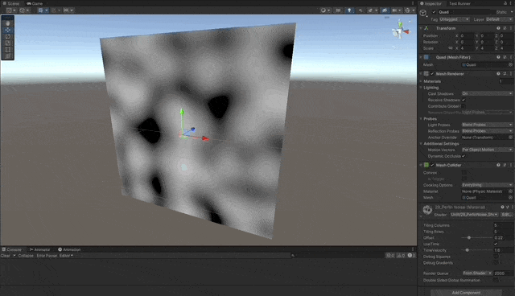
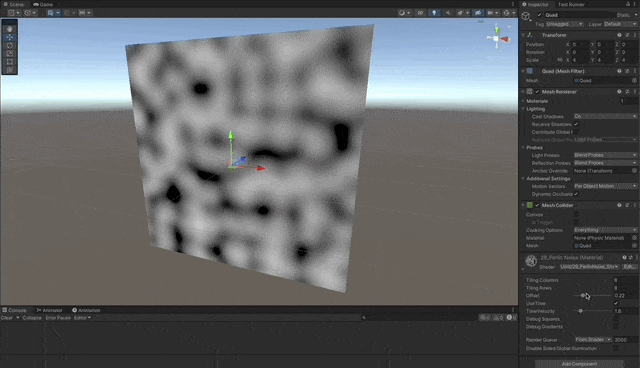
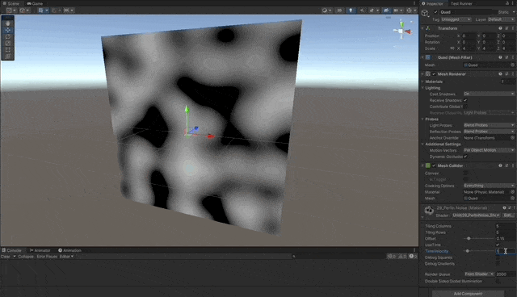
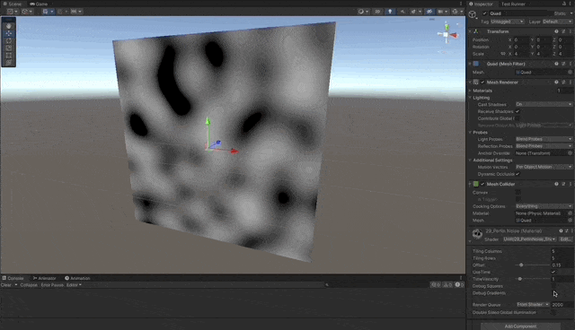

# Perlin Noise

A Perlin Noise Shader written in **Cg** for the **Built-in RP** in Unity.

1. [Perlin Noise](#perlin-noise)
1. [Random Noise](#random-noise)

## Perlin Noise

[Perlin Noise Explained by Fataho](https://www.youtube.com/watch?v=MJ3bvCkHJtE)
[Perlin Noise: A Procedural Generation Algorithm](https://rtouti.github.io/graphics/perlin-noise-algorithm)
[Understanding Perlin Noise](https://adrianb.io/2014/08/09/perlinnoise.html)

- Slice the surface in a grid of rectangles, given the amount of columns and rows.
- Assign a pseudo-random gradient vector of magnitude 1, to each cross point in the grid.
  - These will act as influence vectors for the pixels inside the square.
  - Use a permutations array to generate pseudo-random constant gradients.
- Calculate the distance for every pixel, to each corner of the containing square.
- Do the `dot` scalar multiplication between the distance vector and the corresponding gradient vector.
- Interpolate the 4 dot values for the current pixel.
- Optionally use `_Time` to rotate the gradient vectors over time.

```c
float perlin(
    float2 uv,
    int columns,
    int rows,
    float time = 1,
    float offset = 0.5
)
{
    // square dimensions
    float squareWidth = 1 / float(columns);
    float squareHeight = 1 / float(rows);

    // current square
    int column = floor(uv.x / squareWidth);
    int row = floor(uv.y / squareHeight);

    // corners
    float2 topLeft = float2(0.0,1.0);
    float2 topRight = float2(1.0,1.0);
    float2 bottomLeft = float2(0.0,0.0);
    float2 bottomRight = float2(1.0,0.0);

    // get index for the lookup table
    int X = column % 256;
    int Y = row % 256;

    // gradients
    float2 gradientTopLeft = gradient(P[P[X] + Y+1], time);
    float2 gradientTopRight = gradient(P[P[X+1] + Y+1], time);
    float2 gradientBottomLeft = gradient(P[P[X] + Y], time);
    float2 gradientBottomRight = gradient(P[P[X+1] + Y], time);

    // translate point to local square coordinates
    float2 localPoint = float2(
        (uv.x % squareWidth) / squareWidth,
        (uv.y % squareHeight) / squareHeight
    );

    // distances
    float2 distanceTopLeft = localPoint - topLeft;
    float2 distanceTopRight = localPoint - topRight;
    float2 distanceBottomLeft = localPoint - bottomLeft;
    float2 distanceBottomRight = localPoint - bottomRight;

    // dot
    float dotTopLeft = dot(distanceTopLeft, gradientTopLeft);
    float dotTopRight = dot(distanceTopRight, gradientTopRight);
    float dotBottomLeft = dot(distanceBottomLeft, gradientBottomLeft);
    float dotBottomRight = dot(distanceBottomRight, gradientBottomRight);

    // interpolate
    float2 w = float2(fade(localPoint.x), fade(localPoint.y));

    float interpolatedDot = lerp(
        lerp(dotBottomLeft, dotBottomRight, w.x),
        lerp(dotTopLeft, dotTopRight, w.x),
        w.y
    );

    return (interpolatedDot * 0.5) + offset;
}
```






## Random Noise

- Simple Random Noise generated by a random seed.

```c
float random(float2 pixel, float seed)
{
    // magical hardcoded randomness

    const float a = 12.9898;
    const float b = 78.233;
    const float c = 43758.543123;

    float d = dot(pixel, float2(a,b)) + seed;
    float s = sin(d);

    return frac(s * c);
}
```


